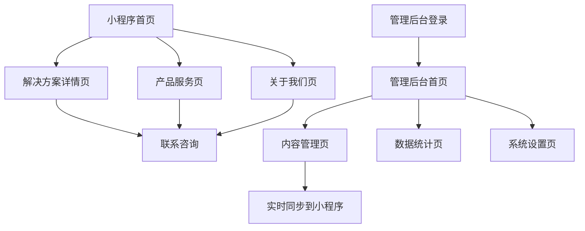

# 微信小程序商务系统产品需求文档

## 1. 产品概述

微信小程序商务系统是一个面向企业的综合性商务展示和管理平台，包含小程序端和管理后台两个核心模块。

- 小程序端提供企业形象展示、产品服务介绍、解决方案展示等功能，帮助企业在微信生态内建立专业的商务形象。
- 管理后台支持内容管理和数据统计，让企业能够实时管理小程序内容并监控用户访问数据。
- 目标是为中小企业提供一站式的微信商务展示解决方案，提升企业在移动端的品牌影响力和客户转化率。

## 2. 核心功能

### 2.1 用户角色

| 角色 | 注册方式 | 核心权限 |
|------|----------|----------|
| 小程序用户 | 微信授权登录 | 浏览企业信息、查看产品详情、联系企业 |
| 管理员 | 账号密码登录 | 管理小程序内容、查看数据统计、系统配置 |

### 2.2 功能模块

我们的微信小程序商务系统包含以下主要页面：

1. **小程序首页**：轮播图展示、导航菜单、核心解决方案、企业介绍
2. **解决方案详情页**：方案详细介绍、案例展示、联系方式
3. **产品服务页**：产品列表、服务介绍、特色功能
4. **关于我们页**：企业简介、团队介绍、联系信息
5. **管理后台首页**：数据概览、快捷操作、系统状态
6. **内容管理页**：轮播图管理、解决方案管理、产品管理
7. **数据统计页**：访问统计、用户行为分析、转化数据
8. **系统设置页**：基础信息配置、权限管理

### 2.3 页面详情

| 页面名称 | 模块名称 | 功能描述 |
|----------|----------|----------|
| 小程序首页 | 轮播图模块 | 展示企业重点信息和活动，支持图片轮播切换，点击跳转详情 |
| 小程序首页 | 导航菜单 | 快速导航到各功能页面，包含图标和文字说明 |
| 小程序首页 | 核心解决方案 | 展示企业主要解决方案，卡片式布局，支持点击查看详情 |
| 小程序首页 | 企业介绍 | 简要介绍企业背景、优势和联系方式 |
| 解决方案详情页 | 方案详情 | 详细介绍解决方案内容、技术特点、应用场景 |
| 解决方案详情页 | 案例展示 | 展示相关成功案例，包含图片和简要说明 |
| 解决方案详情页 | 联系咨询 | 提供联系方式，支持一键拨打电话或添加微信 |
| 产品服务页 | 产品列表 | 展示企业产品和服务，支持分类筛选和搜索 |
| 产品服务页 | 服务介绍 | 详细介绍各项服务内容和优势 |
| 关于我们页 | 企业简介 | 展示企业发展历程、核心价值、资质荣誉 |
| 关于我们页 | 团队介绍 | 介绍核心团队成员和专业背景 |
| 关于我们页 | 联系信息 | 提供详细联系方式和地址信息 |
| 管理后台首页 | 数据概览 | 展示关键数据指标，包含访问量、用户数等 |
| 管理后台首页 | 快捷操作 | 提供常用功能的快速入口 |
| 内容管理页 | 轮播图管理 | 增删改查轮播图内容，支持图片上传和链接设置 |
| 内容管理页 | 解决方案管理 | 管理解决方案内容，包含标题、描述、详情页内容 |
| 内容管理页 | 产品管理 | 管理产品信息，支持分类、图片、详细描述 |
| 数据统计页 | 访问统计 | 展示页面访问量、用户访问路径、停留时间 |
| 数据统计页 | 用户分析 | 分析用户地域分布、设备类型、访问时间 |
| 系统设置页 | 基础配置 | 设置企业基本信息、联系方式、小程序配置 |

## 3. 核心流程

**小程序用户流程：**
用户通过微信进入小程序 → 浏览首页轮播图和核心解决方案 → 点击感兴趣的解决方案查看详情 → 浏览产品服务页了解更多信息 → 通过关于我们页面联系企业 → 完成咨询转化

**管理员操作流程：**
管理员登录后台系统 → 查看数据概览了解运营情况 → 进入内容管理更新轮播图、解决方案等内容 → 通过数据统计分析用户行为 → 根据数据优化内容策略 → 在系统设置中调整配置

## 4. 用户界面设计

### 4.1 设计风格

- **主色调**：企业蓝 #1890FF，辅助色白色 #FFFFFF
- **按钮样式**：圆角矩形按钮，主按钮使用渐变蓝色，次要按钮使用边框样式
- **字体**：微软雅黑，标题 18px，正文 14px，辅助文字 12px
- **布局风格**：卡片式布局，顶部导航，内容区域留白充足
- **图标风格**：线性图标，简洁现代，与整体设计风格保持一致

### 4.2 页面设计概览

| 页面名称 | 模块名称 | UI元素 |
|----------|----------|--------|
| 小程序首页 | 轮播图模块 | 全屏轮播，底部指示器，自动切换间隔3秒，支持手势滑动 |
| 小程序首页 | 导航菜单 | 4宫格布局，圆形图标背景，下方文字说明，点击有反馈动效 |
| 小程序首页 | 核心解决方案 | 卡片式布局，左侧图标，右侧标题和描述，底部查看详情按钮 |
| 解决方案详情页 | 方案详情 | 顶部大图，标题使用大字号，内容分段展示，关键信息高亮 |
| 管理后台首页 | 数据概览 | 仪表盘样式，数据卡片展示，使用图表可视化关键指标 |
| 内容管理页 | 表单界面 | 清晰的表单布局，必填项标红，操作按钮右对齐，支持拖拽排序 |

### 4.3 响应式设计

小程序端采用移动端优先设计，适配不同尺寸的手机屏幕。管理后台采用桌面端设计，支持平板和桌面浏览器访问，确保在不同设备上都有良好的使用体验。