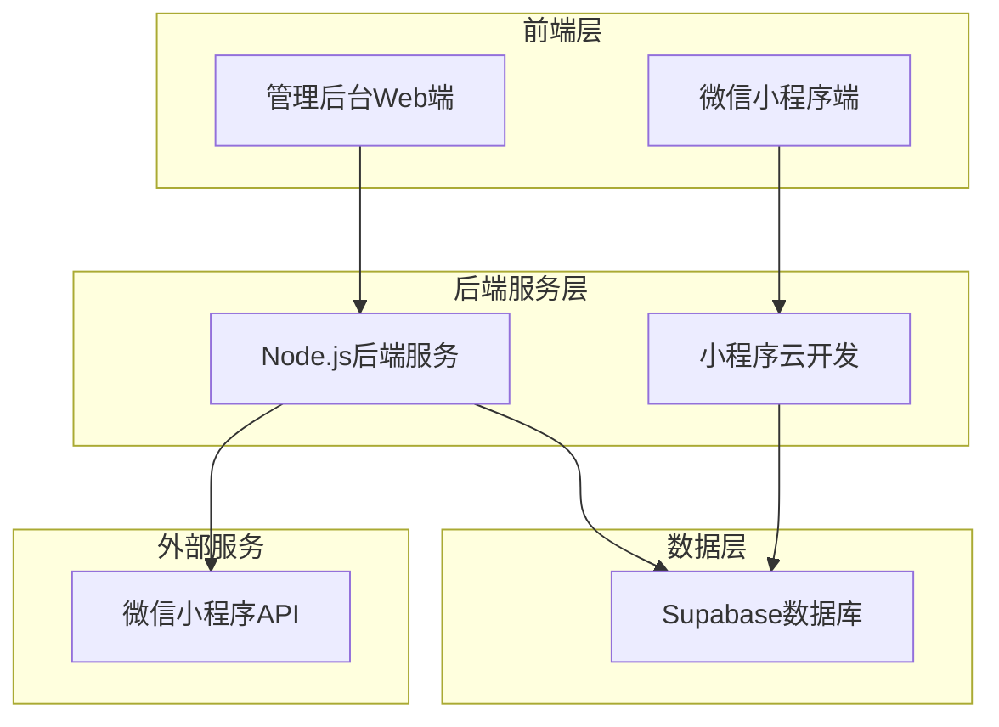
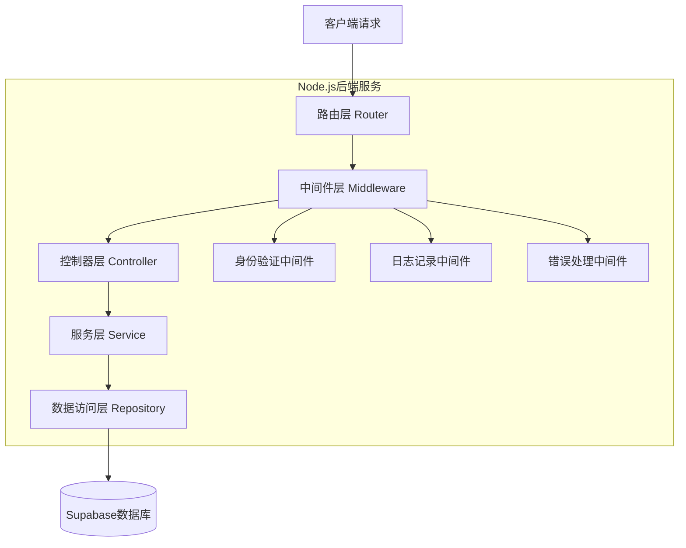
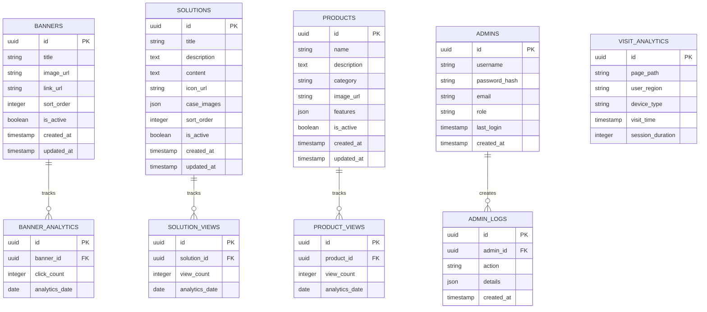

# 微信小程序商务系统技术架构文档

## 1. 架构设计



## 2. 技术描述

* 小程序端：微信小程序原生开发 + 小程序云开发

* 管理后台：React\@18 + Ant Design\@5 + Vite

* 后端服务：Node.js\@18 + Express\@4

* 数据库：Supabase (PostgreSQL)

* 文件存储：Supabase Storage

* 实时通信：Supabase Realtime

## 3. 路由定义

### 3.1 小程序端路由

| 路由                     | 用途                   |
| ---------------------- | -------------------- |
| /pages/index/index     | 首页，展示轮播图、导航菜单和核心解决方案 |
| /pages/solution/detail | 解决方案详情页，展示具体方案内容和案例  |
| /pages/products/index  | 产品服务页，展示企业产品和服务列表    |
| /pages/about/index     | 关于我们页，展示企业介绍和联系信息    |

### 3.2 管理后台路由

| 路由                 | 用途                 |
| ------------------ | ------------------ |
| /login             | 登录页面，管理员身份验证       |
| /dashboard         | 仪表盘首页，展示数据概览和快捷操作  |
| /content/banners   | 轮播图管理，支持增删改查操作     |
| /content/solutions | 解决方案管理，管理方案内容和详情   |
| /content/products  | 产品管理，管理产品信息和分类     |
| /analytics/visits  | 访问统计，展示用户访问数据和行为分析 |
| /settings/basic    | 系统设置，配置基础信息和小程序参数  |

## 4. API定义

### 4.1 核心API

**轮播图管理**

```
GET /api/banners
```

获取轮播图列表

Response:

| 参数名         | 参数类型    | 描述    |
| ----------- | ------- | ----- |
| id          | string  | 轮播图ID |
| title       | string  | 轮播图标题 |
| image\_url  | string  | 图片URL |
| link\_url   | string  | 跳转链接  |
| sort\_order | number  | 排序序号  |
| is\_active  | boolean | 是否启用  |

```
POST /api/banners
```

创建轮播图

Request:

| 参数名         | 参数类型   | 是否必填  | 描述    |
| ----------- | ------ | ----- | ----- |
| title       | string | true  | 轮播图标题 |
| image\_url  | string | true  | 图片URL |
| link\_url   | string | false | 跳转链接  |
| sort\_order | number | false | 排序序号  |

**解决方案管理**

```
GET /api/solutions
```

获取解决方案列表

```
POST /api/solutions
```

创建解决方案

Request:

| 参数名          | 参数类型   | 是否必填  | 描述     |
| ------------ | ------ | ----- | ------ |
| title        | string | true  | 方案标题   |
| description  | string | true  | 方案描述   |
| content      | string | true  | 详细内容   |
| icon\_url    | string | false | 图标URL  |
| case\_images | array  | false | 案例图片数组 |

**数据统计**

```
GET /api/analytics/visits
```

获取访问统计数据

Response:

| 参数名           | 参数类型   | 描述      |
| ------------- | ------ | ------- |
| total\_visits | number | 总访问量    |
| daily\_visits | array  | 每日访问量数据 |
| page\_views   | object | 页面访问量统计 |
| user\_regions | array  | 用户地域分布  |

**用户认证**

```
POST /api/auth/login
```

管理员登录

Request:

| 参数名      | 参数类型   | 是否必填 | 描述  |
| -------- | ------ | ---- | --- |
| username | string | true | 用户名 |
| password | string | true | 密码  |

Response:

| 参数名   | 参数类型   | 描述      |
| ----- | ------ | ------- |
| token | string | JWT访问令牌 |
| user  | object | 用户信息    |

## 5. 服务器架构图



## 6. 数据模型

### 6.1 数据模型定义



### 6.2 数据定义语言

**轮播图表 (banners)**

```sql
-- 创建轮播图表
CREATE TABLE banners (
    id UUID PRIMARY KEY DEFAULT gen_random_uuid(),
    title VARCHAR(255) NOT NULL,
    image_url TEXT NOT NULL,
    link_url TEXT,
    sort_order INTEGER DEFAULT 0,
    is_active BOOLEAN DEFAULT true,
    created_at TIMESTAMP WITH TIME ZONE DEFAULT NOW(),
    updated_at TIMESTAMP WITH TIME ZONE DEFAULT NOW()
);

-- 创建索引
CREATE INDEX idx_banners_sort_order ON banners(sort_order);
CREATE INDEX idx_banners_is_active ON banners(is_active);

-- 权限设置
GRANT SELECT ON banners TO anon;
GRANT ALL PRIVILEGES ON banners TO authenticated;
```

**解决方案表 (solutions)**

```sql
-- 创建解决方案表
CREATE TABLE solutions (
    id UUID PRIMARY KEY DEFAULT gen_random_uuid(),
    title VARCHAR(255) NOT NULL,
    description TEXT NOT NULL,
    content TEXT NOT NULL,
    icon_url TEXT,
    case_images JSON,
    sort_order INTEGER DEFAULT 0,
    is_active BOOLEAN DEFAULT true,
    created_at TIMESTAMP WITH TIME ZONE DEFAULT NOW(),
    updated_at TIMESTAMP WITH TIME ZONE DEFAULT NOW()
);

-- 创建索引
CREATE INDEX idx_solutions_sort_order ON solutions(sort_order);
CREATE INDEX idx_solutions_is_active ON solutions(is_active);

-- 权限设置
GRANT SELECT ON solutions TO anon;
GRANT ALL PRIVILEGES ON solutions TO authenticated;
```

**产品表 (products)**

```sql
-- 创建产品表
CREATE TABLE products (
    id UUID PRIMARY KEY DEFAULT gen_random_uuid(),
    name VARCHAR(255) NOT NULL,
    description TEXT,
    category VARCHAR(100),
    image_url TEXT,
    features JSON,
    is_active BOOLEAN DEFAULT true,
    created_at TIMESTAMP WITH TIME ZONE DEFAULT NOW(),
    updated_at TIMESTAMP WITH TIME ZONE DEFAULT NOW()
);

-- 创建索引
CREATE INDEX idx_products_category ON products(category);
CREATE INDEX idx_products_is_active ON products(is_active);

-- 权限设置
GRANT SELECT ON products TO anon;
GRANT ALL PRIVILEGES ON products TO authenticated;
```

**管理员表 (admins)**

```sql
-- 创建管理员表
CREATE TABLE admins (
    id UUID PRIMARY KEY DEFAULT gen_random_uuid(),
    username VARCHAR(50) UNIQUE NOT NULL,
    password_hash VARCHAR(255) NOT NULL,
    email VARCHAR(255) UNIQUE NOT NULL,
    role VARCHAR(20) DEFAULT 'admin',
    last_login TIMESTAMP WITH TIME ZONE,
    created_at TIMESTAMP WITH TIME ZONE DEFAULT NOW()
);

-- 创建索引
CREATE INDEX idx_admins_username ON admins(username);
CREATE INDEX idx_admins_email ON admins(email);

-- 权限设置
GRANT ALL PRIVILEGES ON admins TO authenticated;
```

**访问统计表 (visit\_analytics)**

```sql
-- 创建访问统计表
CREATE TABLE visit_analytics (
    id UUID PRIMARY KEY DEFAULT gen_random_uuid(),
    page_path VARCHAR(255) NOT NULL,
    user_region VARCHAR(100),
    device_type VARCHAR(50),
    visit_time TIMESTAMP WITH TIME ZONE DEFAULT NOW(),
    session_duration INTEGER DEFAULT 0
);

-- 创建索引
CREATE INDEX idx_visit_analytics_page_path ON visit_analytics(page_path);
CREATE INDEX idx_visit_analytics_visit_time ON visit_analytics(visit_time DESC);
CREATE INDEX idx_visit_analytics_user_region ON visit_analytics(user_region);

-- 权限设置
GRANT INSERT, SELECT ON visit_analytics TO anon;
GRANT ALL PRIVILEGES ON visit_analytics TO authenticated;

-- 初始化数据
INSERT INTO banners (title, image_url, link_url, sort_order) VALUES
('欢迎使用我们的商务解决方案', 'https://example.com/banner1.jpg', '/pages/solution/detail?id=1', 1),
('专业团队为您服务', 'https://example.com/banner2.jpg', '/pages/about/index', 2),
('联系我们获取更多信息', 'https://example.com/banner3.jpg', '/pages/about/index', 3);

INSERT INTO solutions (title, description, content, sort_order) VALUES
('数字化转型解决方案', '帮助企业实现全面数字化升级', '详细的数字化转型实施方案...', 1),
('云服务解决方案', '提供稳定可靠的云计算服务', '完整的云服务架构设计...', 2),
('数据分析解决方案', '深度挖掘数据价值', '专业的数据分析和可视化服务...', 3);
```

